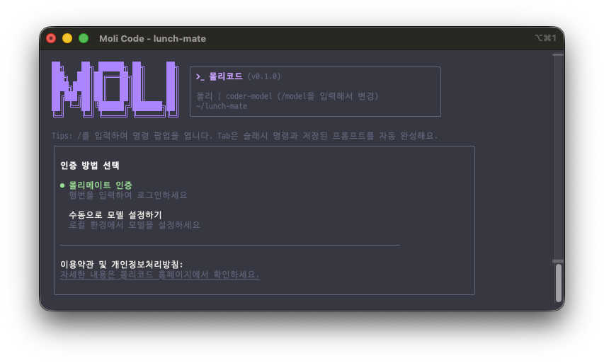

<div align="center">

<br/>


**몰리와 함께하는 AI 한 발짝 — 당신만의 코드를 이해하는 AI 에이전트**

[](https://molicode.vercel.app)
[]()
[]()

<br/>



<br/>

</div>

---

**몰리 코드**는 내부 윈도우 개발 환경에 최적화된 **AI 코딩 에이전트**입니다.
복잡한 코드베이스를 즉시 파악하고, 다양한 업무 문의 해결부터 테스트까지 — 개발자가 업무에만 집중할 수 있는 환경을 만들어줍니다.

<br/>

## 왜 몰리 코드인가요?

|                         | 특징                             | 설명                                                                     |
| ----------------------- | -------------------------------- | ------------------------------------------------------------------------ |
| **다양한 모델**         | OpenAI · Anthropic · Gemini 호환 | 원하는 LLM을 자유롭게 연결하거나, 사내 **몰리메이트** 인증으로 즉시 시작 |
| **에이전트 워크플로우** | 스킬 · 서브에이전트 · 내장 도구  | 단순 질답을 넘어, 자동화된 멀티스텝 워크플로우 수행                      |
| **터미널 퍼스트**       | CLI 중심 + IDE 통합              | 터미널에서 바로 실행하고, VS Code · Eclipse 등과 연동                    |
| **한국어 네이티브**     | 에이전트 전체 한국어 지원        | 프롬프트부터 응답, UI까지 완전한 한국어 경험                             |

---

## 빠른 시작

### 1. 설치

```
https://molicode.vercel.app
```

### 2. 실행

```bash
# 프로젝트 폴더에서 몰리 코드 실행
cd your-project/
moli-code
```

### 3. 인증 설정

```bash
# 세션 내에서 인증 메뉴 호출
/auth
```

처음 실행 시 인증을 설정하라는 메시지가 표시됩니다. `/auth` 명령어로 언제든 인증 방식을 전환할 수 있습니다.

### 4. 사용해보기

```text
이 프로젝트는 어떤 역할을 하나요?
코드베이스 구조를 자세하게 설명해줘.
이 함수를 리팩토링하는 것을 도와줘.
이 모듈에 대한 단위 테스트(Unit test)를 생성해줘.
```

---

## 인증

몰리 코드는 두 가지 인증 방식을 지원합니다.

### 몰리메이트 인증 (권장)

사번을 입력하여 간편하게 인증하는 사내 지원 방식입니다.

```bash
/auth
# → "몰리메이트로 인증" 선택 → 사번 입력
```

### 로컬 환경 구성

외부 모델(OpenAI, Anthropic, 커스텀 API 등)을 직접 설정하여 사용합니다.
`/auth` → "로컬 환경" 선택 후 API 엔드포인트와 모델명을 입력하면 `~/.moli/settings.json`이 자동 구성됩니다.

<details>
<summary><b>settings.json 커스텀 설정 예시</b></summary>

```json
{
  "modelProviders": {
    "openai": [
      {
        "id": "gpt-4o",
        "name": "GPT-4o",
        "envKey": "OPENAI_API_KEY",
        "baseUrl": "https://api.openai.com/v1"
      }
    ],
    "anthropic": [
      {
        "id": "claude-sonnet-4-20250514",
        "name": "Claude Sonnet 4",
        "envKey": "ANTHROPIC_API_KEY"
      }
    ]
  },
  "env": {
    "OPENAI_API_KEY": "sk-...",
    "ANTHROPIC_API_KEY": "sk-ant-..."
  },
  "security": {
    "auth": {
      "selectedType": "openai"
    }
  },
  "model": {
    "name": "gpt-4o"
  }
}
```

</details>

> **보안 주의사항:** 버전 관리 시스템(Git 등)에 절대로 API 키를 커밋하지 마세요. `~/.moli/settings.json` 파일은 반드시 로컬에 안전하게 보관해야 합니다.

---

## 사용법

### 대화형 모드

프로젝트 폴더에서 `moli-code`를 실행하면 인터페이스가 열립니다. `@` 기호로 파일/폴더를 컨텍스트로 참조할 수 있습니다.

```bash
cd your-project/
moli-code
```

### 헤드리스 모드

인터랙티브 UI 없이 단일 입력에 대한 결과만 받으려면 `-p` 플래그를 사용하세요. CI/CD 파이프라인이나 스크립트에 유용합니다.

```bash
moli-code -p "방금 수정한 코드를 리뷰하고 요약해줘."
```

### IDE 통합

VS Code, Eclipse 등 주요 IDE와 연동하여 사용할 수 있습니다.

- [VS Code 통합 가이드](docs/users/integration-vscode.md)

---

## 명령어 레퍼런스

### 세션 명령어

| 명령어           | 설명                                          |
| ---------------- | --------------------------------------------- |
| `/help`          | 사용 가능한 전체 명령어와 단축키 도움말       |
| `/agents`        | 사용자 맞춤형 서브에이전트 관리 및 생성       |
| `/auth`          | 인증 방법 변경 (몰리메이트 / 로컬 환경)       |
| `/approval-mode` | 계획모드 · 기본모드 · 자동편집모드 · yolo모드 |
| `/clear`         | 대화 기록과 컨텍스트 초기화                   |
| `/compress`      | 토큰 절약을 위한 대화 기록 압축               |
| `/stats`         | 세션 사용량 및 상세 통계                      |
| `/bug`           | 버그 리포트                                   |
| `/exit`          | 종료                                          |

### 키보드 단축키

| 단축키              | 설명                      |
| ------------------- | ------------------------- |
| `Ctrl+C`            | 현재 작업 취소            |
| `Ctrl+D`            | 종료 (입력창 비어있을 때) |
| `↑ / ↓`             | 프롬프트 히스토리 탐색    |
| `Shift+Tab` / `Tab` | 도구 승인 자동 모드 토글  |

> **Tip:** `!` 접두사로 셸 명령어를 직접 실행할 수 있습니다. (예: `!npm run build`, `!ls -al`)

---

## 설정 파일

| 파일 위치               | 적용 범위            | 설명                                  |
| ----------------------- | -------------------- | ------------------------------------- |
| `~/.moli/settings.json` | 사용자 (User)        | 모든 세션에 적용. API 키 및 기본 설정 |
| `.moli/settings.json`   | 프로젝트 (Workspace) | 프로젝트별 설정. 사용자 설정보다 우선 |

---

## 문제 해결

사용 중 문제가 발생하면 CLI 창에서 `/bug` 명령어를 입력하거나, 에이전트에게 직접 오류 상황을 설명해주세요.

자세한 내용은 [문제 해결 가이드](docs/users/support/troubleshooting.md)를 참고하세요.

---

## 감사 인사

본 프로젝트는 [Google Gemini CLI](https://github.com/google-gemini/gemini-cli) 및 [Qwen-Code](https://github.com/QwenLM/qwen-code)에 기반을 두고 있습니다. 뛰어난 개발자분들의 결과물에 깊은 감사를 표합니다. 몰리 코드는 이를 바탕으로 커스텀 프레임워크/솔루션 연계, LLM 모델 연동 및 한국어 지원 등 내부 환경에 특화된 기능들을 추가·개선했습니다.

---

<div align="center">

**[설치하기](https://molicode.vercel.app)** · **[문제 해결](docs/users/support/troubleshooting.md)**

AI와 함께 성장하려는 도비가.

</div>
